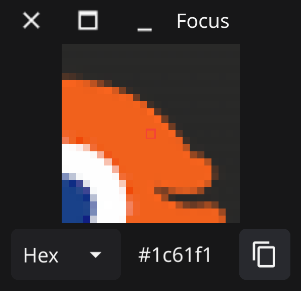

# Focus - desktop zoom for X11

Zoom in to the pixels of your display to check details

Features:

* Show the pixels around mouse cursor in detail
* Read the colour value of a pixel (Hex or rgb)

## Screenshot

